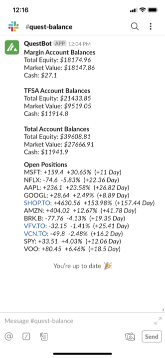

QuestBalance is a lambda function written in Python which pulls in your stock position data and calculates your percentage gains(losses) to provide a daily summary of your account activity via Slack.

It utilizes the [Questrade developer API](https://www.questrade.com/api) to fetch account positions with [Questrade](https://www.questrade.com/home) - a leading brokerage in Canada, and using the data fetched from their API to calculate your total balance and position summaries. 

AWS Lambda is a serverless compute tool which lets you run arbitrary code over specificed time intervals. A cronjob is scheduled to run the function every 30 minutes during regular NYSE stock market hours (9:30 - 4:00pm ET). An example of the summary messages sent can be seen below. 

For more detailed architecture diagrams and explanations on the various aspects of QuestBalance check out the pages listed below:

{}

