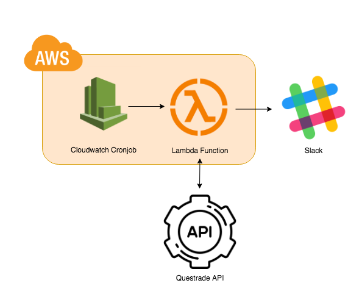

## QuestBalance Architecture

Under the hood, QuestBalance is entirely serverless.

At its core it is a set of [AWS Lambda](https://aws.amazon.com/lambda/) functions which are configured (via [CloudWatch Events](https://docs.aws.amazon.com/AmazonCloudWatch/latest/events/WhatIsCloudWatchEvents.html)) to trigger periodically and fetch/send account activity from Questrades' API to Slack. 

The architecture can be better visualized using the diagram below.

